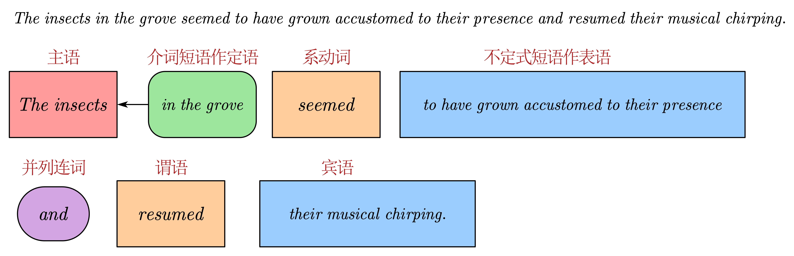

- ((66a85680-303d-4585-8e80-a5afd309c8fd))
  ((66a8a40b-7cf1-4b38-94a1-84ebc1c8ca2c))
- # 原文
  background-color:: pink
	- “What will it take? Do you have even a rough idea?”
	  “怎样做，你有大概的设想吗？”
	- “No. Not yet. Perhaps the brain can be connected directly to a computer, which can use its computing power to ==amplify== human intelligence. Or maybe we can achieve a direct ==interface== between human brains and ==blend== different people’s thoughts. Or ==inherit== memories. But whatever ==avenue== we ==ultimately== take to increase human intelligence, we must first begin from a ==fundamental== understanding of the ==mechanisms== of the human brain.”
	  “没有，现在还没有。也许可以把大脑与计算机直接连接，使后者的计算能力成为人类的智力放大器；也许能够实现人类大脑间的直接互联，把多人的思维融为一体；还有记忆遗传等等。但不管最后提升智力的途径有哪些，我们现在首先要做的是从根本上了解人类大脑思维的机制。”
		- [[amplify]]
		  {{embed ((66a87945-bafb-4e51-9f4d-e9883a83e53a))}}
		- [[interface]]
		  {{embed ((66a87b3d-4ffb-4c91-8528-cbf6b23a0386))}}
		- [[blend]]
		  {{embed ((66a87ec1-9ab4-4f77-a94a-ee419c32e897))}}
		- [[inherit]]
		  {{embed ((66a87ffc-cb9f-4d5c-9a13-0ccc32a20a4b))}}
		- [[avenue]]
		  {{embed ((66a880dc-b99b-4589-893c-6c816b110440))}}
		- [[ultimately]]
		  {{embed ((66a88193-5ab9-4f03-8716-580429d342ed))}}
		- [[fundamental]]
		  {{embed ((66a88211-bd79-49fb-8477-c8922e61ba7e))}}
		- [[mechanism]]
		  {{embed ((66a882d6-2ee2-4d75-93f3-f66a2f86bedc))}}
	- “And that’s precisely our area of interest.”
	  “这正是我们的事业。”
	- “We can continue in the same career as before. The difference will be that we can ==tap== huge resources to do it!”
	  “我们要继续这项事业了，与以前一样，不同的是现在能够调动巨量的资源来干这事！”
		- [[tap]]
		  {{embed ((66a883f4-3c93-42e8-926c-1b0e74fbd837))}}
	- “Love, I’m truly happy. I’m ==ecstatic==! There’s just one thing. As a Wallfacer, don’t you think this plan is a little…”
	  “亲爱的，我真的很高兴，我太高兴了！只是，作为面壁者，你这个计划，太……”
		- [[ecstatic]]
		  {{embed ((66a8851a-be2b-4029-9e44-0ccb35fc0724))}}
	- “A little indirect? Maybe. But think about it, Keiko. Human civilization ultimately comes down to humans themselves. If we start by ==elevating== humans, doesn’t that make this a ==far-reaching== plan? Besides, what else can I do?”
	  “太间接了，是吧？但惠子，你想想，人类文明的一切最终要归结到人本身，我们从提升人的自身做起，这不正是一个真正有远见的计划吗？再说，除了这样，我还能做什么呢？”
		- [[elevate]]
		  {{embed ((768e0752-2d53-4604-8e87-d97e8a5a1051))}}
		- [[far-reaching]]
		  {{embed ((66a887b6-6995-478a-b2ab-30473c1722bc))}}
	- “Bill, you’re wonderful!”
	  “比尔，这真的太好了！”
	- “So think about this for a moment: If we turn ==neuroscience== and thought research into a world engineering project, and can invest an ==inconceivably== enormous amount of money in it, how long will we have to wait for success?”
	  “让我们设想一下，把脑科学和思维研究作为一个世界工程来做，有我们以前无法想象的巨大投入，多长时间能取得成功呢？”
		- [[neuroscience]]
		  {{embed ((66a88895-bbfc-4489-9070-ec4aa26d12cf))}}
		- [[inconceivably]]
		  {{embed ((66a889c5-bcdd-45bc-bcb0-81e0ad0e8429))}}
	- “About a century, more or less.”
	  “一个世纪应该差不多吧。”
	- “Let’s be a little more ==pessimistic== and say two centuries. Then the highly intelligent humans will still have two centuries left, and if they use one century to develop fundamental science and another to turn those theories into technology…”
	  “就让我们更悲观些，算两个世纪，这样的话，高智力的人类还有两个世纪的时间，如果用一个世纪发展基础科学，再用一个世纪来实现理论向技术的转化……”
		- [[pessimistic]]
		  {{embed ((66a88ad1-3306-44f4-a5c8-201139b20fad))}}
		-
	- “Even if it fails, we’ll have done what we wanted to do.”
	  “即使失败了，我们也是做了迟早要做的事情。”
	- “Keiko, come with me to the end of days,” Hines ==murmured==.
	  “惠子，随我一起去末日吧。”希恩斯喃喃地说。
		- [[murmur]]
		  {{embed ((66a88e66-1c33-4302-a9ea-c93843d43c9b))}}
		-
	- “Yes, Bill. We certainly have the time.”
	  “好的，比尔，我们有的是时间。”
	- The insects in the grove seemed to have grown ==accustomed== to their presence and resumed their musical ==chirping==. When a soft wind blew through the bamboo and the stars in the night sky flashed through the gaps between the leaves, it was as if the insect ==chorus== was ==issuing== from those stars.
	  林中的夏虫似乎适应了他们的存在，又恢复了悠扬的鸣叫。这时一阵轻风吹过竹林，使得夜空中的星星在竹叶间飞快闪动，让人觉得夏虫的合唱仿佛是那些星星发出的。
		- #长句 The insects in the grove seemed to have grown accustomed to their presence and resumed their musical chirping.
		  {:height 250, :width 724}
			-
		- [[accustom]]
		  {{embed ((66a88fa2-1153-4ad3-9b3f-fee6e596f7b0))}}
		- [[chirp]]
		  {{embed ((66a8917f-2c9d-4e05-b67a-e8868881a071))}}
		- [[chorus]]
		  {{embed ((66a89024-7957-4cfa-a2e9-3b25638c2063))}}
		- [[issue]]
		  {{embed ((66a892ad-9c67-4796-8d6e-e8659f0a387a))}}
		-
-