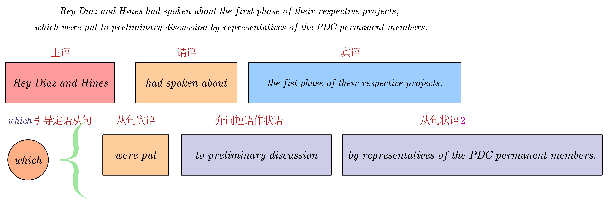

- ((66de493f-5d41-4f27-a7e1-3ea2b8e196da))
  ((66de495a-8cfc-4475-ac0b-63ad84a14130))
- # 原文
  background-color:: pink
	- It was day three of the PDC’s first Wallfacer Project ==Hearing==. Rey Diaz and Hines had spoken about the first phase of their ==respective== projects, which were put to preliminary discussion by representatives of the PDC permanent members.
	  行星防御理事会第一次面壁者听证会已经进行了三天，泰勒、雷迪亚兹和希恩斯三位面壁者分别在会议上陈述了自己的第一阶段计划，PDC常任理事国代表对这些计划进行了初步的讨论。
		- #长句 Rey Diaz and Hines had spoken about the first phase of their respective projects, which were put to preliminary discussion by representatives of the PDC permanent members.
		  {:height 250, :width 724}
		- [[hearing]]
		  {{embed ((66de6ea3-5c44-42d5-9863-50d30d887893))}}
		- [[respective]]
		  {{embed ((66de6f77-321d-4f4e-aca7-870e4d9662b8))}}
		-
	- Rey Diaz and Hines had both submitted their plans at the previous hearing, but Tyler had delayed his first ==disclosure== until this session, leaving representatives particularly eager for details.
	  (本段为译者添加部分，中文原著中没有)雷迪亚兹和希恩斯在之前的听证会上都已经提交了他们的计划，但泰勒直到这次会议才首次披露他的计划，这让代表们对他的计划细节充满兴趣。
		- [[disclosure]]
		  {{embed ((66de701a-f66b-4dc8-ad9c-b8c049ac063e))}}
		-
	- Tyler started with a brief introduction: “I need to establish an armed force in space that will ==supplement== Earth’s fleet but be under my command.”
	  (本段为译者添加部分，中文原著中没有)泰勒首先做了一个简短的说明：“我计划在太空中建立一支武装力量，作为地球舰队的补充。但是这支力量必须听从我的指挥。”
		- [[supplement]]
		  {{embed ((66de711f-1740-418f-9bdf-8761c05f6eaf))}}
	- Just one sentence in, the hands of the other two Wallfacers shot up.
	  (本段为译者添加部分，中文原著中没有)泰勒刚说完一句话，其他两位面壁者的手就举了起来。
	- “Mr. Hines and I have been ==accused== of overuse of resources in our plans,” Rey Diaz broke in. “But this is ==absurd==. Mr. Tyler wants to have his own space force!”
	  (本段为译者添加部分，中文原著中没有)"希恩斯先生和我都被指责在各自的计划中使用过度的资源，"雷迪亚兹插话道，“但泰勒先生显然更荒谬，他想拥有一支自己的太空军队！”
		- [[accuse]]
		  {{embed ((66de71b8-9e7a-4aa7-b074-95ed983c0d36))}}
		- [[absurd]]
		  {{embed ((66de75cf-6be5-4a73-99b5-a39483cd7c8b))}}
	- “I didn’t say it was a space force,” Tyler said calmly. “The intent is not to construct warships or large spaceships, but to establish a fleet of space ==fighters==. They’ll each be roughly the size of a conventional Earth-based fighter and will carry a single pilot. They’ll be like mosquitoes in space, so I’ve ==dubbed== this the ‘mosquito swarm plan.’ The formation needs to be at least equal to the size of the invading Trisolaran Fleet. A thousand ships.”
	  (本段为译者添加部分，中文原著中没有)“我并没有说它是太空军队，”泰勒平静地说，“我的意图不是建造战舰或巨型飞船，而是建立一支太空战斗机舰队。它们每艘的大小与地球上的传统战斗机差不多，并且只搭载一个飞行员。它们在太空中就像蚊子一样，所以我称之为‘蚊群计划’。整个编队至少要与入侵的三体舰队规模相当，也就是一千艘。”
		- [[fighter]]
		  {{embed ((66de7649-a42a-456d-a9c7-fd13a9c7e4a8))}}
		- [[dub]]
		  {{embed ((66de7697-4e5b-45f4-8f86-a8a57403e375))}}
	- “You would attack a Trisolaran warship with a mosquito? That’s not even going to raise a ==welt==,” a hearing member said ==dismissively==.
	  (本段为译者添加部分，中文原著中没有)“你想用一只蚊子去攻击三体战舰？那根本连个包都咬不出来。”听证会的一位成员轻蔑地说。
		- [[welt]]
		  {{embed ((66de7859-77d9-41c3-88af-b25c356bd366))}}
		- [[dismissively]]
		  {{embed ((66de7928-3583-4dee-ad19-86815902b46b))}}
		-
	- Tyler raised a finger. “Not if each of those mosquitoes is equipped with a hundred-megaton-class hydrogen bomb. So I’m going to need the latest superbomb technology.… Don’t turn me down immediately, Mr. Rey Diaz. You can’t ==turn me down==, in fact. According to the principles of the Wallfacer Project, that technology isn’t your ==proprietary== property. Once it’s been developed, I have the right to ==requisition== it.”
	  (本段为译者添加部分，中文原著中没有)泰勒竖起一根手指，“如果每只蚊子都装备有一百万吨级的氢弹呢？所以，我需要最新的超级炸弹技术……雷迪亚兹先生，请不要马上拒绝我。事实上，你也不能拒绝我。根据面壁者计划的原则，这项技术不是你的专有财产，一旦它被开发出来，我就有权征用。”
		- [[turn me down]]
		  {{embed ((66de79cf-1fd2-4450-bc20-d505d9409d71))}}
		- [[proprietary]]
		  {{embed ((66de7a40-0d33-4aa9-be08-47a9fbc12892))}}
		- [[requisition]]
		  {{embed ((66de7a9b-56b5-4dd8-9549-4ebc698ef4d7))}}
		-
	- Rey Diaz glanced up at him. “My question is, do you intend to ==plagiarize== my plan?”
	  (本段为译者添加部分，中文原著中没有)雷迪亚兹抬头看了他一眼，“我的问题是，你是打算抄袭我的计划吗？”
		- [[plagiarize]]
		  {{embed ((66de7b20-ba18-4cd7-b7db-6456f558bb2f))}}
	- Tyler smiled ==sardonically==. “If a Wallfacer’s plan can be copied, is he still a Wallfacer?”
	  (本段为译者添加部分，中文原著中没有)泰勒冷笑了一下，“如果一个面壁者的计划可以被复制，那他还算是面壁者吗？”
		- [[sardonically]]
		  {{embed ((66de7baf-a423-4eb8-867e-6d49a2cbf33a))}}
	- “Mosquitoes can’t fly very far,” said Garanin, the PDC rotating chair.“These toy space fighters can only engage in combat within the orbit of Mars, I believe.”
	  (本段为译者添加部分，中文原著中没有)PDC轮值主席伽尔宁说，“蚊子飞不了多远，我认为，这些玩具般的太空战斗机只能在火星轨道附近进行战斗。”
	- “Watch out. His next request might be for a space carrier,” Hines said with a chuckle.
	  (本段为译者添加部分，中文原著中没有)“小心，也许下一次他的计划就是太空航母了。”希恩斯笑着说。
-