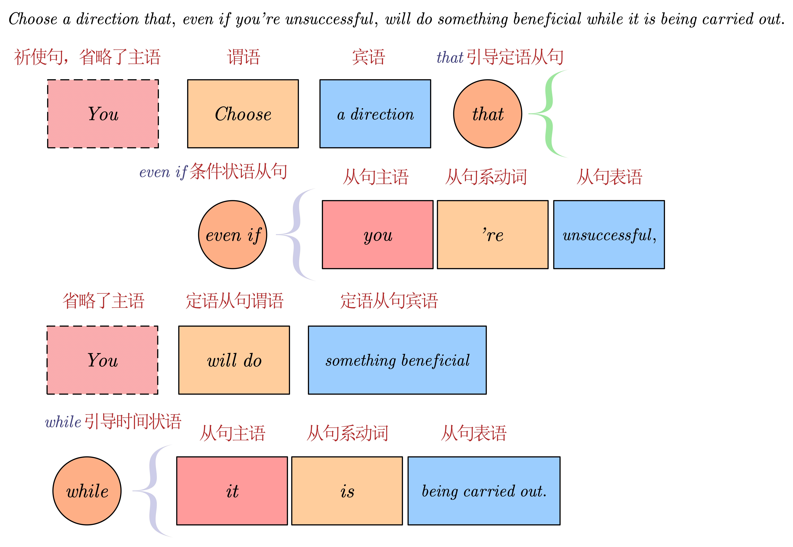

- {{video https://www.bilibili.com/video/BV15J4m1M7aU/?spm_id_from=333.999.0.0}}
- ((66936413-ba08-4a87-a2fe-d6bdae6ec5a0))
           希恩斯转过身来，但在竹林的黑暗中，他的面孔仍看不清，“怎么可能，我每迈出一小步，都要消耗巨大的资源。”
-
- # 原文
	- He turned around, but in the darkness of the ==grove== his face was ==indistinct==. “How is that possible? Every step I take consumes a massive amount of resources.”
	  希恩斯转过身来，但在竹林的黑暗中，他的面孔仍看不清，“怎么可能，我每迈出一小步，都要消耗巨大的资源。”
		- [[grove]]
		  {{embed ((66936bb4-82e8-44fc-967f-c2c7de5635d7))}}
		- [[indistinct]]
		  {{embed ((669370bb-e166-4e8b-b940-6bc04e3a68e1))}}
	-
	- “Then why not adopt this approach?” Keiko’s answer came ==swiftly==. She had obviously been thinking about the question. “Choose a direction that, even if you’re unsuccessful, will do something beneficial while it is being ==carried out==.”
	  “那为什么不这样呢，”惠子的回答接得很快，显然她早就思考过这个问题，“选择这样一个方向，即使最后不成功，在执行过程中也是做了有益的事。”
		- [[swiftly]]
		  {{embed ((669378f5-8ffc-4a39-a893-854469fff62a))}}
		- [[carry out]]
		  {{embed ((669379f6-1c8e-44f0-930d-dc879eebf392))}}
		- #长句 Choose a direction that, even if you’re unsuccessful, will do something beneficial while it is being carried out.
		  
			- **主句**：Choose a direction
				- 这是一个祈使句，省略了主语（通常是“你”或“你们”），直接以动词原形“Choose”开头，表示一种建议或要求; “a direction”是“Choose”的宾语
			- **定语从句**：that, even if you’re unsuccessful, will do something beneficial while it is being carried out
				- 这个定语从句修饰前面的宾语“a direction”，进一步说明了这个方向应该具有的特性。
				- **引导词**：“that”引导了这个定语从句，它在定语从句中不充当任何句子成分，但连接了主句和从句。
			- **条件状语从句**：even if you’re unsuccessful
				- 这个从句用“even if”引导，表示一种让步条件，即“即使”你失败了。
				- 它修饰了定语从句中的主句部分“will do something beneficial”，说明即使失败，选择的方向也会带来某种好处。
			- **主句部分**：will do something beneficial
				- 这是定语从句的核心部分，表示选择的方向将会“做一些有益的事情”。
				- 使用了将来时态“will do”，表示这种好处是在未来发生的。
			- **时间状语从句**：while it is being carried out
				- 这个从句用“while”引导，表示“当……的时候”，即当这个方向正在被实施或执行的时候。
				- 它修饰了“will do something beneficial”，进一步说明了这种好处是在方向被实施的过程中发生的。
				- “it”指代前面提到的“a direction”，即这个方向本身。
		-
	-
	- “Keiko, that’s exactly what I’ve been thinking about. Here’s what I’ve decided to do: Even if I can’t come up with a plan, I can help other people think of one.”
	  “惠子，这正是刚才我所想的，我决定要做的是：既然自己想不出那个计划，就帮助别人想出来。”
	-
	- “What other people? The other Wallfacers?”
	  “你说的别人是谁？其他的面壁者吗？”
	-
	- “No, they’re not much ==better off== than I am. I mean our ==descendants==. Keiko, have you ever considered this fact? The outcome of natural biological evolution requires at least twenty thousand years to ==manifest== itself, but human civilization has just five thousand years of history, and modern technological civilization just two hundred. That means that the study of modern science today is being done by the brain of ==primitive== man.”
	  “不是，他们并不比我强到哪里去，我指的是后代。惠子，你有没有想过这样一个事实：生物的自然进化要产生明显的效果需要至少两万年左右的时间，而人类文明只有五千年历史，现代技术文明只有二百年历史，所以，现在研究现代科学的，只是原始人的大脑。”
		- [[better off]]
		  {{embed ((66937acb-ee4c-4278-bf09-fd44f83c68e1))}}
		- [[descendant]]
		  {{embed ((66937b27-2c70-4830-b50c-e3e897b3ab06))}}
		- [[manifest]]
		  {{embed ((66937c09-5004-41bc-b967-a96c047632d2))}}
		- [[primitive]]
		  {{embed ((66937d3b-1133-4c57-9dd3-cca1df160b38))}}
	-
	- “You want to use technology to accelerate the brain’s evolution?”
	  “你想借助技术加快人脑的进化？”
	-
	- “We’ve been doing brain research, and we ought to put more effort into expanding it to a scale that can ==tackle== a planetary defense system. If we work hard for a century or two, we might be able to increase human intelligence and allow the science of the future to break out of the sophons’ prison.”
	  “你知道，我们一直在做脑科学研究，现在应该投入更大的力量做下去，把这种研究扩大到建设地球防御系统那样的规模，努力一至两个世纪，也许能够最终提升人类的智力，使得后世的人类科学能够突破智子的禁锢。”
		- [[tackle]]
		  {{embed ((66937fdb-6ee1-4200-81fa-f12041b4840c))}}
	-
	- “Intelligence is a vague term in our field. What in particular—”
	  “对我们这个专业来说，智力一词有些空泛，你具体是指……”
	-
	- “I mean intelligence in the ==broadest== sense of the word. Not just the traditional meaning of logical reasoning, but learning ability, imagination, and ==innovation== as well. And also the ability to accumulate common sense and experience while preserving intellectual ==vigor==. And enhancing mental ==endurance==, so that a brain can think continuously without ==fatigue==. And we can even consider the possibility of ==eliminating== sleep. And so forth.”
	  “我说的智力是广义的，除了传统意义上的逻辑推理能力外，还包括学习的能力、想象力和创新能力，包括人在一生中在积累常识和经验的同时仍保持思想活力的能力，还包括加强思维的体力，也就是使大脑不知疲倦地长时间连续思考——这里甚至可以考虑取消睡眠的可能性……”
		- [[broad]]
		  {{embed ((669380ca-11fd-4759-9cee-548e1cde4e16))}}
		- [[innovation]]
		  {{embed ((66938231-9a0c-4d0f-b7d7-c95f185e8e37))}}
		- [[vigor]]
		  {{embed ((669382db-61e6-4fba-9755-8327963b03dd))}}
		- [[endurance]]
		  {{embed ((66939778-fc06-4dbe-9424-69212ff82279))}}
		- [[fatigue]]
		  {{embed ((6693a1d0-3eda-4ec6-8278-1eb14760373b))}}
		- [[eliminate]]
		  {{embed ((6693a305-16e9-4031-af29-1d1089ea9a3b))}}